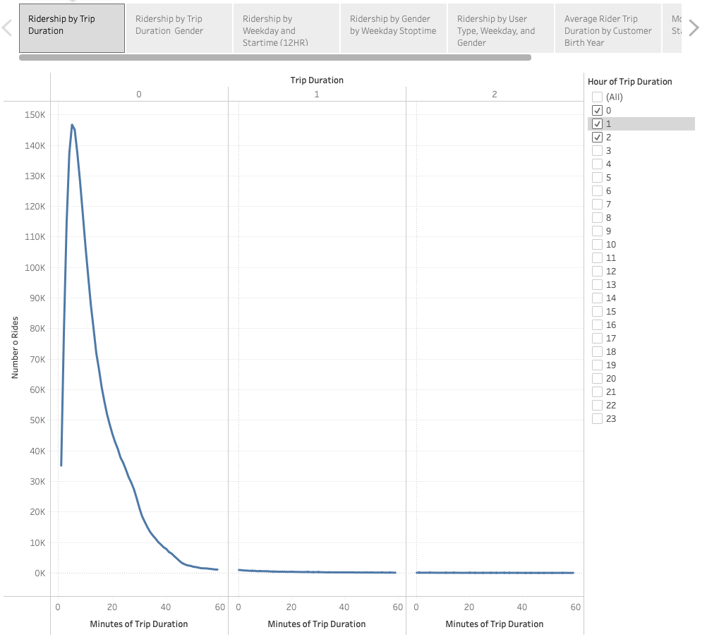
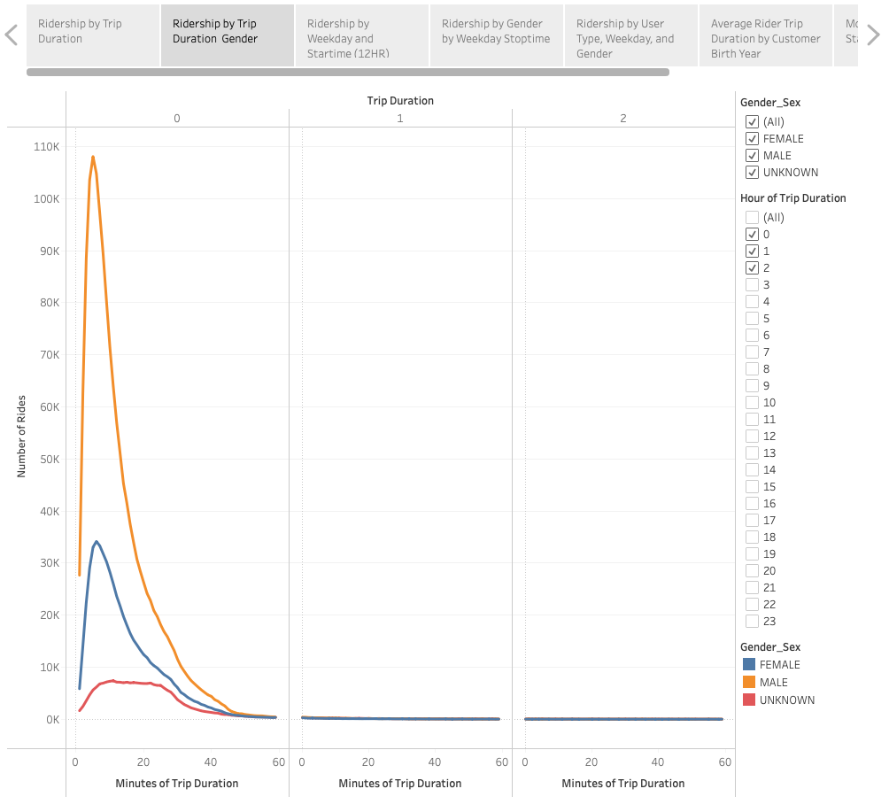
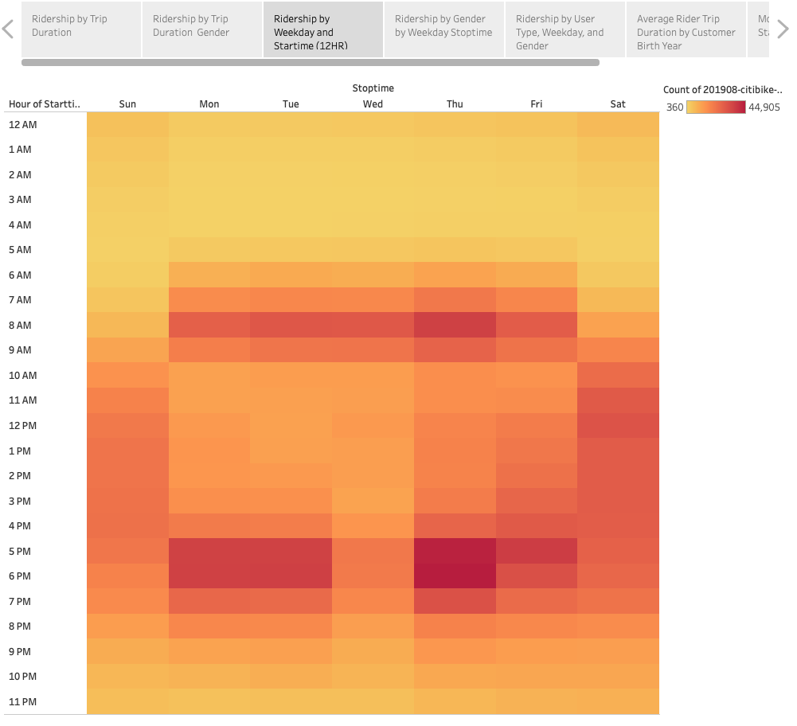
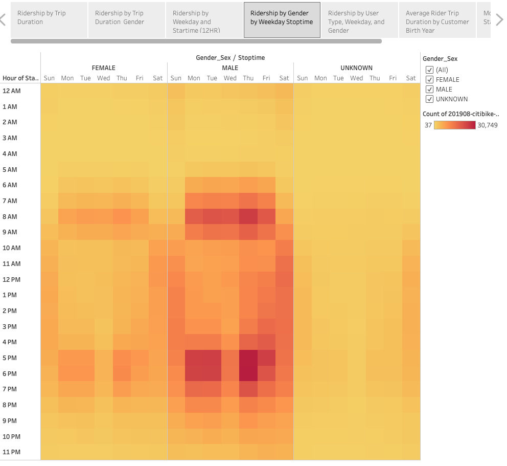
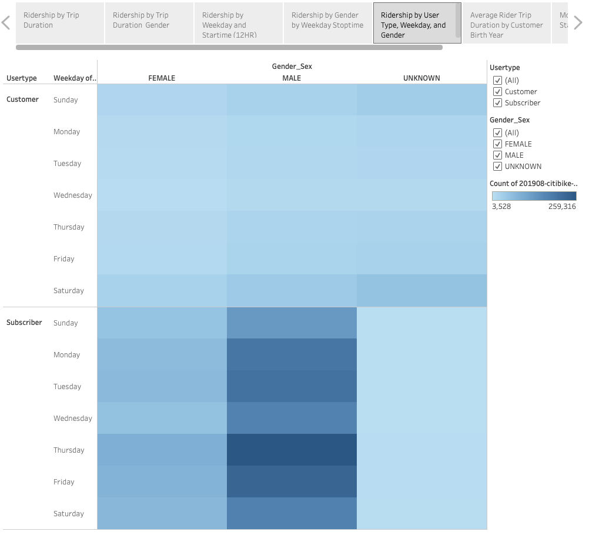
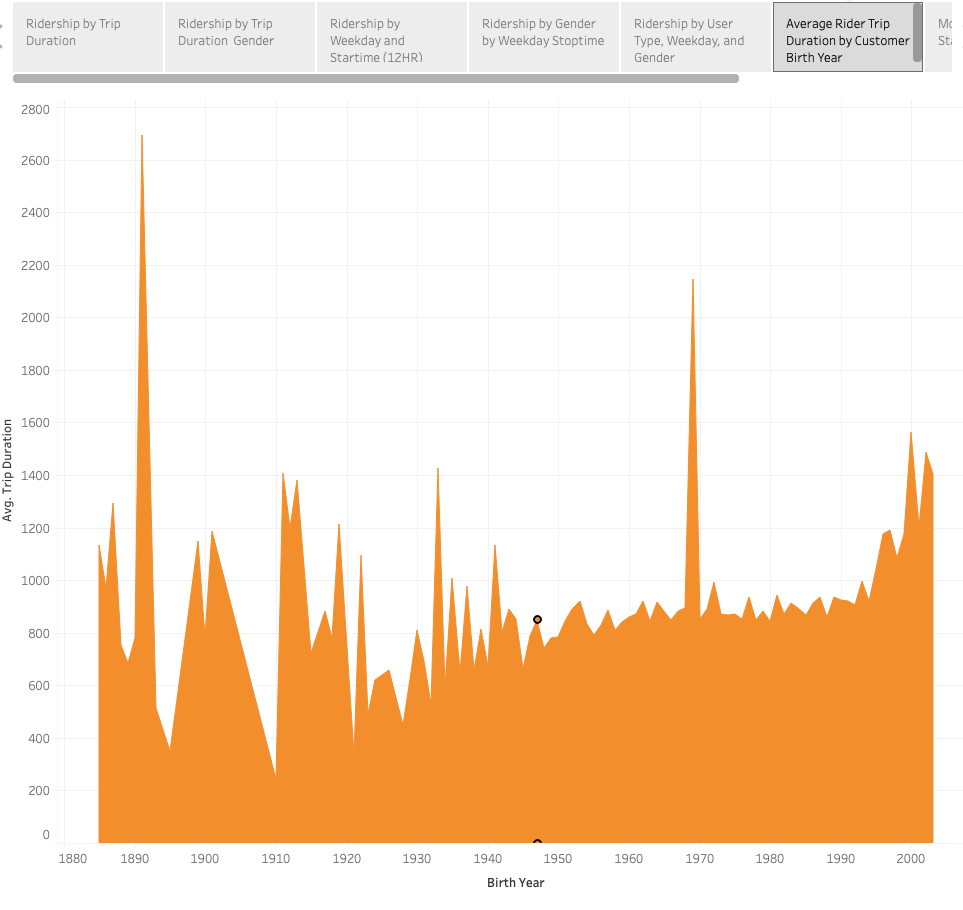
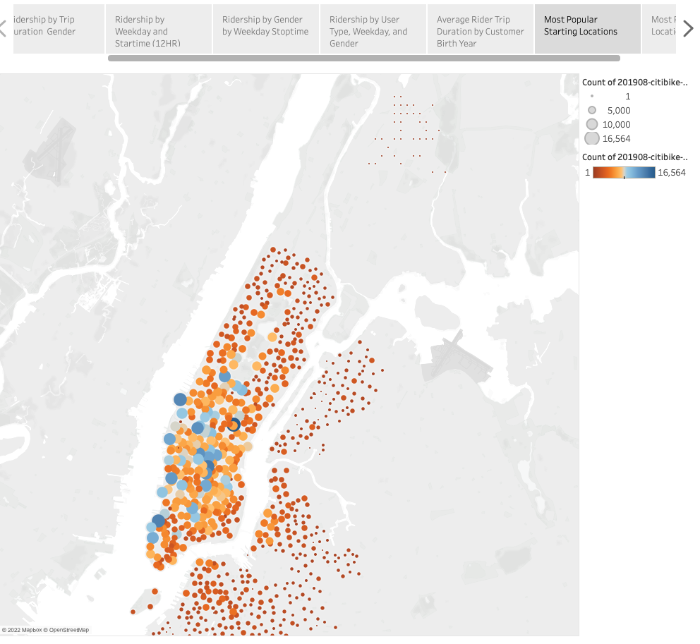
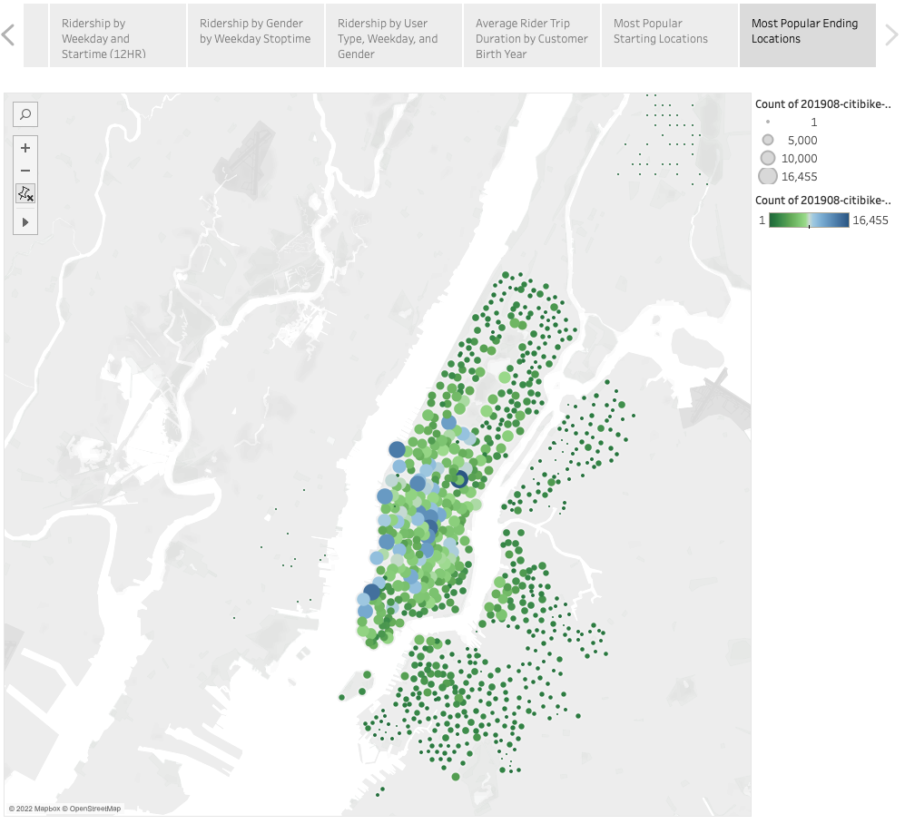

# NYC CitiBike Ridership Analysis

[NYC CitiBike Story] (https://public.tableau.com/app/profile/melanie.p.jenkins/viz/NYCCitiBikeRidership/NYCCitiBikeRidershipAnalysis?publish=yes)

## Overview of the status analysis 

### Purpose of Analysis

An analysis of NYC CitiBike Analysis was conducted to provide stakeholder insight into opportunities for improvement. More has work to been done to convince investors that a bike-sharing program in Des Moines is a solid business proposal. To solidify the proposal, the following data points are provided. 

 	1. Time that bikes are checked out for all riders and genders

	2. Ridership times by genders for each hour of each day of the week

	3. Ridership for each type of user and gender for each day of the week.

Additional insight include, 

	4. Average Duration of Trip by User Age Indicator 
	5. Most popular starting/stopping points for bike-share riders. 

## Results

### Visualizations and Description

Viz-1. Ridership by Trip Duration

The vast majority of riders spend less than 20 minutes on a trip.  

Viz-2. Ridership by Trip Duration and Gender

While majority of riders are male, all three gender groups trended similarly and did not have trips lasting greater than 20 minutes.  

Viz-3. Ridership by Weekday and Start-time/Stop-time 

Most bike-sharing trips occur between the hours 5PM and 7Pm. The pattern occur most weekdays, with the exception of Wednesday. 

Viz-4. Ridership by Gender, Weekday and Stop-time

Similar to the Viz-2, the majority of ridership is done by males. This figure also identifies which group has the greatest ridership during the peak hours referenced in Viz-3. 

Viz-5. Ridership by User Type, Weekday, and Gender

From this visitation, there is no question that the majority of ridership is by Male, Subscribers. The proposal should highlight this group as the target audience considering they patronize the bike-sharing the service most days.  

Viz-6. Average Trip Duration by Birth Year

Considering the data is from a public source, it is clear there are anomalies in the data. This slide is presented for the purposes of letting us consider a better age calculation to indicate age. 

Viz-7. Most Popular Starting Locations

Most popular locations are along the water on the west side. It may be a good idea to market the ride-sharing proposal around this area. 

Viz-8. Most Popular Stopping Locations

Similar to Viz-7, the most popular locations to stop are along the basin. Keeping in the average duration of trips, and the largest proportion spend less than 20 minutes, mapping attractions nearby may be helpful. 

## Summary

In summary, the major rider demographic is men in the subscriber user-group. Moreover, the majority of starts and stop occur along the war and for less that 20 minutes. 

Additional analysis should include a better variable to indicate age. The proposal should examine in greater detail the demographic being best serve. Based on Vis-6, it may be users in a mid-career age or in retirement that are a better target. 

